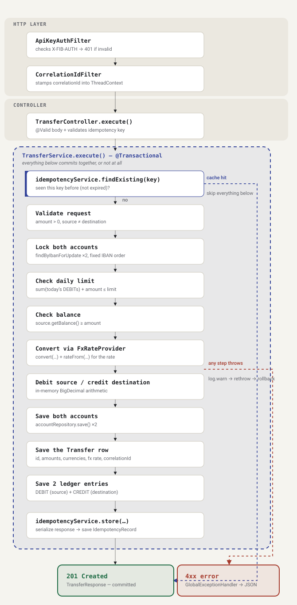
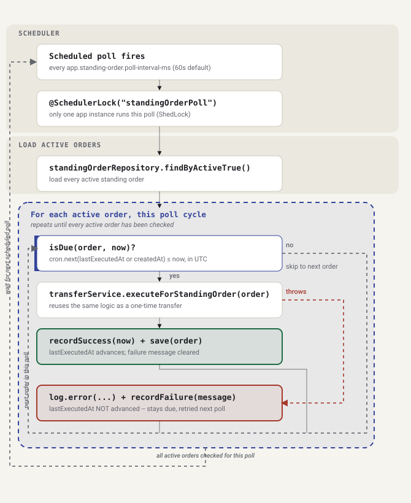

# Banking System Transfer Module

An inter-account transfer and standing order service. It supports one-time
transfers, recurring (standing order) transfers, cross-currency conversion,
and double-entry bookkeeping for every transfer.

## Running it

**With Docker:**

```bash
docker compose up
```

The app starts at `http://localhost:8080`. On startup, Liquibase creates the
schema and seeds four accounts (see the table below). Everything runs in one
container -- the database is H2, in memory, so there's no separate database
to set up.

**API key:** every `/api/v1/**` request needs an `X-FIB-AUTH` header.
Locally, the default key is `local-dev-secret-change-me` (see
`application.yml` / `docker-compose.yml`). For a real deployment, set the
`FIB_API_KEY` environment variable instead -- the key is never hardcoded in
the source code.

**Postman:** import
`postman/Banking-System-Transfer-Module.postman_collection.json` and
`postman/Banking-System-Transfer-Module.postman_environment.json` into
Postman, select the environment, and run the requests. The environment
already has the default API key and the seeded account IBANs filled in.

## Seeded accounts

| IBAN | Owner | Currency | Initial balance |
|---|---|---|---|
| BG01FINV001 | Ivan Petrov | USD | 10 000.00 |
| BG01FINV002 | Maria Koleva | EUR | 5 000.00 |
| BG01FINV003 | Georgi Ivanov | USD | 2 500.00 |
| BG01FINV004 | Elena Todorova | EUR | 8 000.00 |

## Architecture decisions



*What a single `POST /api/v1/transfers` call passes through, from the servlet
filters to the HTTP response. The dashed blue path is an idempotency cache
hit (skips straight to the stored response); the dashed red path is any step
throwing partway through (rolls the whole transaction back).*

**Locking.** Two transfers touching the same account can't run at the same
time. Before a transfer moves any money, it locks both accounts with
`SELECT ... FOR UPDATE` (`AccountRepository#findByIbanForUpdate`), inside one
`@Transactional` method. To avoid a deadlock when two transfers cross each
other (A->B and B->A at the same time), the accounts are always locked in
the same order -- sorted by IBAN, not by which one is the source. `Account`
also has an `@Version` column as a backup: if some future code path ever
updated a balance without taking the lock, this would catch it.

**Idempotency.** Every response to a `POST /transfers` request is saved in
the `idempotency_records` table, keyed by the `X-Idempotency-Key` header. If
the same key is sent again within 24 hours, the saved response is returned
as-is and the transfer is not repeated. After 24 hours, the key is treated
as new. The check and the save both happen inside the same transaction as
the transfer itself, so a key can never end up pointing to two different
results.

**Double-entry bookkeeping.** Every successful transfer writes one row to
`transfers` (the overall record, including the FX rate if one was applied)
and two rows to `ledger_entries` -- a DEBIT on the source account and a
CREDIT on the destination account. Ledger rows are never updated or deleted.
A correction is always a new, opposite entry, never an edit to history.

**Daily limit.** Each account has a daily outgoing limit, checked against
UTC calendar days. Instead of keeping a separate running total, the check
adds up that day's DEBIT ledger entries for the account. That way the
ledger stays the single source of truth, with no second number that could
drift out of sync with it. The check happens inside the same lock as the
transfer, so two transfers running at once can't both slip past the limit.

**Cross-currency transfers.** `FxRateProvider` treats USD as the base
currency. Every other currency has one configured rate: how many units of
that currency equal 1 USD (`app.fx.rates.<CODE>`, e.g. `app.fx.rates.EUR`,
default `0.86`, overridable via the `FX_RATE_USD_TO_EUR` environment
variable -- the same property the spec calls `fx.rate.usd-to-eur`, just
placed under this module's own `app.*` config). Converting from USD or to
USD uses that rate directly; converting between two non-USD currencies goes
through USD as a middle step. Adding a new currency later is just one new
config line plus one new `Currency` enum value -- no code changes needed.
The daily limit and balance checks always use the source account's own
currency and amount, per the spec.



*How the scheduler processes standing orders, one poll cycle at a time. The
dashed gray paths are how an order gets skipped (not due yet) or loops back
to the next one; the dashed red path is a failed transfer -- note it still
loops back to "next order" rather than stopping the poll.*

**Standing orders.** Each standing order stores its own cron expression.
One scheduled job (`app.standing-order.poll-interval-ms`, every 60 seconds
by default) checks all active orders: for each one, it works out when it's
next due (based on its last successful run, or its creation time if it's
never run) and compares that to now. If an order is due, it runs through
the exact same transfer logic as a normal one-time transfer.
`@SchedulerLock` (ShedLock) makes sure only one running instance of the app
executes this job at a time, even if the app is scaled to multiple
instances.

*What happens on failure:* if a standing order's transfer fails, its "last
run" time is deliberately not updated. That means the next poll still sees
it as due, so it's retried automatically -- instead of waiting for its next
scheduled cron time, which could be a long wait. The spec says a failed
order must never be skipped silently, and retrying on the very next poll is
the most direct way to honor that. Every failure is logged with its reason.

**Authentication.** `ApiKeyAuthFilter` is a plain servlet filter that checks
the `X-FIB-AUTH` header against the configured key on every `/api/**`
request, before the request reaches any controller. It's a filter rather
than full Spring Security because a single static API key doesn't need
anything more. It writes its own error response directly, in the same JSON
shape as the rest of the app, since a filter runs too early for
`@RestControllerAdvice` to catch it. `/actuator/health` (used by the Docker
healthcheck) is exempt from this check.

**Error format.** One class, `GlobalExceptionHandler`, turns every
exception into the same JSON shape from the spec:
`{timestamp, status, error, message, path}`. Business rule failures
(insufficient funds, daily limit exceeded, invalid transfer) become 422.
Missing resources become 404. Bad or malformed requests become 400. A
missing or wrong API key becomes 401.

**Logging.** Log4j2 logs asynchronously (`AsyncLoggerContextSelector`,
backed by the LMAX Disruptor library), so logging never blocks a request.
Every transfer attempt -- whether it succeeds or fails -- is logged from
`TransferService`. Each request gets a correlation ID (set by
`CorrelationIdFilter`, reusing an incoming `X-Correlation-Id` header if the
caller sent one) so every log line for that request can be tied together.

**Virtual threads** are turned on (`spring.threads.virtual.enabled: true`).
This module does a lot of blocking JDBC calls, so virtual threads let it
handle many requests at once without needing a large thread pool.

## Assumptions

The spec doesn't allow asking clarifying questions, so a few open questions
were resolved by always picking the most literal reading of the spec:

- A non-positive amount, insufficient funds, an account that doesn't exist,
  and exceeding the daily limit are all treated as 422 Unprocessable
  Entity -- the spec's own example error is a 422, and it groups these
  together as things a transfer must fail on. Looking up a resource
  directly that doesn't exist (`GET /accounts/{iban}`,
  `GET /standing-orders/{id}`) is a plain 404 instead, since that's a
  different kind of failure -- a lookup, not a transfer rule.
- A transfer request has no currency field. The source and destination
  accounts' own currencies decide whether FX conversion happens, and which
  rate is used.
- Replaying the same `X-Idempotency-Key` returns the exact original
  response, including the original `201 Created` status -- the spec asks
  for "the same response," not a different status on replay.
- Each standing order has its own cron expression (the `cronExpression`
  field on creation), rather than one global schedule for every order,
  since every order can need a different recurrence.

## Testing

- `TransferServiceTest` (unit, mocked repositories): successful
  same-currency transfer, successful cross-currency transfer with FX
  applied, insufficient funds, daily limit exceeded, and idempotent
  duplicate-key replay.
- `TransferIntegrationTest` (`@SpringBootTest` + `MockMvc`): drives a real
  transfer through the full HTTP -> controller -> service -> H2 database
  stack, checks both accounts' balances afterward, and checks that an
  idempotent replay doesn't move money twice.

```bash
mvn test
```

## Tech stack

Java 25 - Spring Boot 4 - Maven - H2 (in-memory) - Liquibase - Log4j2
(async, LMAX Disruptor) - ShedLock - Docker / Docker Compose.
